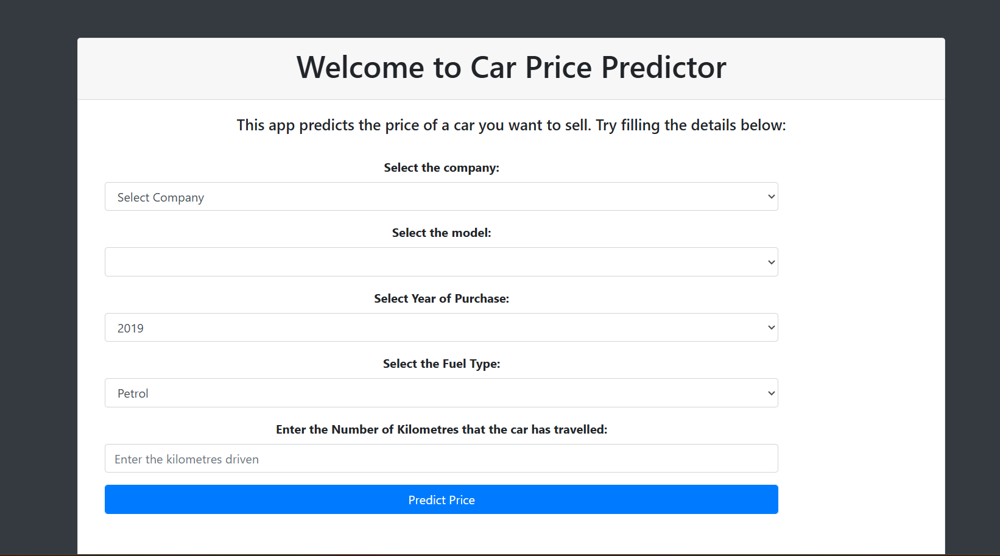

# 🚗 Car Price Prediction Web App

This project is a **Car Price Predictor** built using **Linear Regression**. The application takes inputs like car brand, model year, fuel type, kilometers driven, and transmission type to estimate the selling price. The model is deployed as a web app using the **Flask framework**.

---

## 📌 Features

- 🔢 Predict car prices using a trained Linear Regression model.
- 🌐 Interactive web interface using HTML, CSS, and Flask.
- 📊 Machine Learning model trained on cleaned car dataset.
- 🧠 Encodes categorical inputs and scales features.
- 📁 Model serialized using `pickle` and loaded at runtime.

---

## 📷 Demo

> A working demo of the UI (example preview):
 *(Add this if you have a screenshot)*

---

## 🛠️ Tech Stack

| Layer        | Technology           |
|--------------|----------------------|
| Backend      | Python, Flask        |
| ML Model     | Scikit-learn (Linear Regression) |
| Frontend     | HTML, CSS            |
| Deployment   | Localhost / GitHub   |

---

<pre><code>## 📁 Project Structure ``` Car-Price-Prediction-App/ │ ├── app.py # Main Flask application ├── LinearRegressionModel.pkl # Pickled machine learning model ├── Cleaned_Car.csv # Dataset (optional) ├── requirements.txt # Python dependencies ├── .gitignore # Git ignore rules │ ├── static/ # Static files (CSS, JS, images) │ └── css/ │ └── style.css # Styling for the web page │ ├── templates/ # HTML templates │ └── index.html # Main UI form ``` </code></pre>

